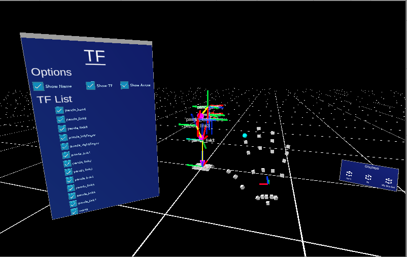
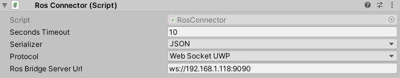
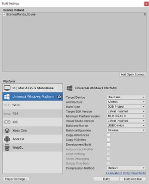

# ARviz - an AR-based Visualisation tool for ROS

Welcome to ARviz!

  

## Requirements

- Unity 2019.4.4f1
    - Make sure Universal Windows Platform is selected during installation
- Visual Studio 2019
    - Make sure the following are selected:
        - 'Universal Windows Platform development' under 'Workloads'
        - C++ Universal Windows Platform support for v142 build tools (ARM64)
        - MSVC v142 - VS 2019 C++ - ARM64 build tools (latest)
        - Windows 10 SDK (10.0.19041.0)

## Included

- ROS#
- MixedRealityToolkit 2.4.0
- Vuforia 9.28
- TextMeshPro

## Usage

- Create a copy of sample scene
- Modifiy the ROS Connector's ROSConnector property with the IP address of your ROS machine as shown below  
  
- For HoloLens (UWP) projects, make sure to keep the "Protocol" field to be "WebSocketUWP"
- Read through the README in [Scripts](Assets/Scripts) folder  
- Implement your functionality or just try out our already implemented functionality  
- Deploy your app and enjoy :)  

## Deploy Unity applications onto HoloLens 2

- Make sure your HoloLens is not on standby and developer mode is enabled
- Check the Unity console window to see if there are any script compilation errors or warnings that require amending before attempting to deploy your application onto the Hololens
- From the top bar, select "File" and then click on "Build Settings", the following window should appear:  
  
- Firstly, add the relevant scenes you would like in your build, to add the scene you currently have open, press the Add Open Scenes button, and it should appear listed under Scenes in Build with a tick next to it  
- After the necessary scenes have been added, select Universal Windows Platform as the target platform on the bottom left of the window and click "Switch Platform" located at the bottom if not already selected  
- For "Target Device", select "HoloLens"  
- For "Architecture", select "ARM64" 
- For "Build and Run on", if your HoloLens device is connected via USB, select "USB Device", otherwise select "Remote Device" and enter the HoloLens' details to deploy remotely (via WiFi)   
- For "Build Configuration", use "Release" or "Debug" when testing, and "Master" for deployment of the final solution  
- Choose "Build And Run" and your application should build, compile, and be deployed onto the HoloLens
- There should be around 21 errors when building, this is because of the conflict in the serializer that we used. However, the build should return **SUCCESS** at the end. If not, then check your codes for any other errors  

## Feedback appreciated

Our goal is trying to create a package which can be used by any programmers for any AR-HRI-related projects. The READMEs are prepared so anyone can implement their own functionalities from our template. However, in the case that READMEs are confusing or unclear, please let us know and we will try to address it ASAP  

Thank you for feedback!  
